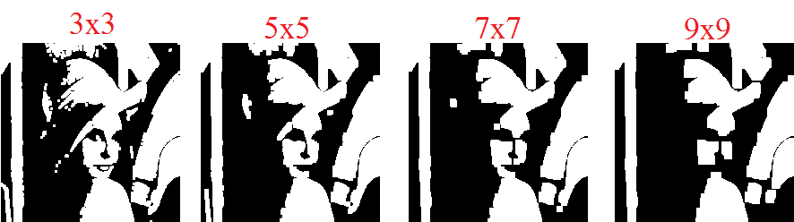
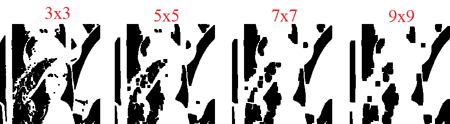

# 作業一 opencv 與 AVX

## 需求

把一張影像做灰階化後做 threasholding，門檻值為 128，大於 128 為 255，小於或等於 128 為 0。
接著做 morphology 裡面的 open 和 close，各做 100 次，kernel 要為 3x3 到 9x9 之間，紀錄做 open 和 close 的執行速度。

比對以下項目的差別：

1. 沒有使用 AVX
2. 使用 AVX
3. 查 multi thread(map & reduce)加速

## 原圖

## 灰階

## 二值化

## opening

## closing

## 結果比對

### 參數

- 相片大小：200x200
- 迴圈數：100

### 電腦 1

- CPU: i7-4770 8 核心
- RAM: 16G

#### 單執行緒

| kernel size | threads | method  |   use avx(second)   | not use avx(second)  |
| :---------: | :-----: | :-----: | :-----------------: | :------------------: |
|     3x3     |    1    | opening | 0.00600028038024902 | 0.004000425338745117 |
|     5x5     |    1    | opening | 0.00600028038024902 | 0.005000114440917969 |
|     7x7     |    1    | opening | 0.01000046730041503 | 0.005000591278076172 |
|     9x9     |    1    | opening | 0.00800037384033203 | 0.005000114440917969 |
|     3x3     |    1    | closing | 0.00600051879882812 | 0.004000425338745117 |
|     5x5     |    1    | closing | 0.00700020790100097 | 0.005000114440917969 |
|     7x7     |    1    | closing | 0.01000070571899414 | 0.005000114440917969 |
|     9x9     |    1    | closing | 0.00800013542175293 | 0.007000446319580078 |

#### 執行緒比較

| kernel size | threads | method  |   use avx(second)   | not use avx(second) |
| :---------: | :-----: | :-----: | :-----------------: | :-----------------: |
|     3x3     |    1    | opening | 0.01900124549865722 | 0.01500082015991211 |
|     3x3     |    2    | opening | 0.01700115203857422 | 0.01200079917907714 |
|     3x3     |    3    | opening | 0.01400065422058105 | 0.01300072669982910 |
|     3x3     |    4    | opening | 0.01100063323974609 | 0.01300072669982910 |
|     3x3     |    5    | opening | 0.01200079917907714 | 0.01100039482116699 |
|     3x3     |    1    | closing | 0.01600098609924316 | 0.01500082015991211 |
|     3x3     |    2    | closing | 0.01400065422058105 | 0.01300072669982910 |
|     3x3     |    3    | closing | 0.01200079917907714 | 0.01300096511840820 |
|     3x3     |    4    | closing | 0.01100039482116699 | 0.01200056076049804 |
|     3x3     |    5    | closing | 0.01400089263916015 | 0.01200079917907714 |

| kernel size | threads | method  |   use avx(second)    | not use avx(second) |
| :---------: | :-----: | :-----: | :------------------: | :-----------------: |
|     5x5     |    1    | opening | 0.021001100540161133 | 0.01600122451782226 |
|     5x5     |    2    | opening | 0.017000913619995117 | 0.01300072669982910 |
|     5x5     |    3    | opening | 0.013000726699829102 | 0.01200032234191894 |
|     5x5     |    4    | opening | 0.012000799179077148 | 0.01300096511840820 |
|     5x5     |    5    | opening | 0.012000799179077148 | 0.01200079917907714 |
|     5x5     |    1    | closing | 0.018001079559326172 | 0.01800084114074707 |
|     5x5     |    2    | closing | 0.015001058578491211 | 0.01400089263916015 |
|     5x5     |    3    | closing | 0.013000726699829102 | 0.01100063323974609 |
|     5x5     |    4    | closing | 0.012000322341918945 | 0.01100087165832519 |
|     5x5     |    5    | closing | 0.013000726699829102 | 0.01300072669982910 |

| kernel size | threads | method  |   use avx(second)   | not use avx(second) |
| :---------: | :-----: | :-----: | :-----------------: | :-----------------: |
|     7x7     |    1    | opening | 0.01900100708007812 |  0.02000117301940   |
|     7x7     |    2    | opening | 0.01400065422058105 |  0.01300048828125   |
|     7x7     |    3    | opening | 0.01400089263916015 |  0.01200079917907   |
|     7x7     |    4    | opening | 0.01300072669982910 |  0.01400089263916   |
|     7x7     |    5    | opening | 0.01200079917907714 |  0.01100087165832   |
|     7x7     |    1    | closing | 0.01900124549865722 |  0.01500082015991   |
|     7x7     |    2    | closing | 0.01400089263916015 |  0.01500082015991   |
|     7x7     |    3    | closing | 0.02300119400024414 |  0.01400089263916   |
|     7x7     |    4    | closing | 0.01200056076049804 |  0.01200079917907   |
|     7x7     |    5    | closing | 0.01500105857849121 |  0.02100110054016   |

| kernel size | threads | method  |   use avx(second)   | not use avx(second) |
| :---------: | :-----: | :-----: | :-----------------: | :-----------------: |
|     9x9     |    1    | opening | 0.02200126647949218 | 0.01700091361999511 |
|     9x9     |    2    | opening | 0.01400089263916015 | 0.01300072669982910 |
|     9x9     |    3    | opening | 0.01300072669982910 | 0.01300072669982910 |
|     9x9     |    4    | opening | 0.01400089263916015 | 0.01200079917907714 |
|     9x9     |    5    | opening | 0.01300096511840820 | 0.01500082015991211 |
|     9x9     |    1    | closing | 0.02000117301940918 | 0.02200126647949218 |
|     9x9     |    2    | closing | 0.01300072669982910 | 0.01600074768066406 |
|     9x9     |    3    | closing | 0.01300072669982910 | 0.01400089263916015 |
|     9x9     |    4    | closing | 0.01400089263916015 | 0.01300072669982910 |
|     9x9     |    5    | closing | 0.01400065422058105 | 0.01200056076049804 |

### 電腦 2

- CPU: E5-1630 8 核心
- RAM: 32G

#### 單執行緒

| kernel size | threads | method  |   use avx(second)    | not use avx(second) |
| :---------: | :-----: | :-----: | :------------------: | :-----------------: |
|     3x3     |    1    | opening | 0.003494501113891601 | 0.02685880661010742 |
|     5x5     |    1    | opening | 0.004256010055541992 | 0.04694437980651855 |
|     7x7     |    1    | opening | 0.005731105804443359 | 0.05359244346618652 |
|     9x9     |    1    | opening | 0.005433320999145508 | 0.07101178169250488 |
|     3x3     |    1    | closing | 0.003380537033081054 | 0.02314949035644531 |
|     5x5     |    1    | closing | 0.004204034805297851 | 0.03726482391357422 |
|     7x7     |    1    | closing | 0.005691051483154297 | 0.05341196060180664 |
|     9x9     |    1    | closing | 0.005456924438476562 | 0.07101941108703613 |

#### 執行緒比較

| kernel size | threads | method  |   use avx(second)   | not use avx(second) |
| :---------: | :-----: | :-----: | :-----------------: | :-----------------: |
|     3x3     |    1    | opening | 0.01644253730773925 | 0.0380015373229980  |
|     3x3     |    2    | opening | 0.01333022117614746 | 0.0217492580413818  |
|     3x3     |    3    | opening | 0.01290392875671386 | 0.0219058990478515  |
|     3x3     |    4    | opening | 0.01620793342590332 | 0.0187449455261230  |
|     3x3     |    5    | opening | 0.01602721214294433 | 0.0206146240234375  |
|     3x3     |    1    | closing | 0.02360391616821289 | 0.0443425178527832  |
|     3x3     |    2    | closing | 0.01999592781066894 | 0.0314283370971679  |
|     3x3     |    3    | closing | 0.01809287071228027 | 0.0251526832580566  |
|     3x3     |    4    | closing | 0.01826715469360351 | 0.0229978561401367  |
|     3x3     |    5    | closing | 0.01871347427368164 | 0.0235862731933593  |

| kernel size | threads | method  |   use avx(second)   | not use avx(second) |
| :---------: | :-----: | :-----: | :-----------------: | :-----------------: |
|     5x5     |    1    | opening | 0.0209352970123291  | 0.02342081069946289 |
|     5x5     |    2    | opening | 0.0181479454040527  | 0.01718068122863769 |
|     5x5     |    3    | opening | 0.0165636539459228  | 0.01695752143859863 |
|     5x5     |    4    | opening | 0.0161082744598388  | 0.01671147346496582 |
|     5x5     |    5    | opening | 0.0168573856353759  | 0.01803278923034668 |
|     5x5     |    1    | closing | 0.02552127838134765 | 0.0197844505310058  |
|     5x5     |    2    | closing | 0.02153968811035156 | 0.0179522037506103  |
|     5x5     |    3    | closing | 0.01718544960021972 | 0.0172228813171386  |
|     5x5     |    4    | closing | 0.01742672920227050 | 0.0167696475982666  |
|     5x5     |    5    | closing | 0.01804351806640625 | 0.0180382728576660  |

| kernel size | threads | method  |   use avx(second)    | not use avx(second) |
| :---------: | :-----: | :-----: | :------------------: | :-----------------: |
|     7x7     |    1    | opening | 0.024954795837402344 | 0.02760481834411621 |
|     7x7     |    2    | opening | 0.022012710571289062 | 0.02345585823059082 |
|     7x7     |    3    | opening | 0.018171310424804688 | 0.01939558982849121 |
|     7x7     |    4    | opening | 0.017789602279663086 | 0.01917290687561035 |
|     7x7     |    5    | opening | 0.017701387405395508 | 0.01974415779113769 |
|     7x7     |    1    | closing | 0.02916693687438965  | 0.02508735656738281 |
|     7x7     |    2    | closing | 0.02003169059753418  | 0.02208423614501953 |
|     7x7     |    3    | closing | 0.01801681518554687  | 0.01586556434631347 |
|     7x7     |    4    | closing | 0.01696300506591797  | 0.01596450805664062 |
|     7x7     |    5    | closing | 0.01921868324279785  | 0.01719021797180175 |

| kernel size | threads | method  |  use avx(second)   | not use avx(second)  |
| :---------: | :-----: | :-----: | :----------------: | :------------------: |
|     9x9     |    1    | opening | 0.0282442569732666 | 0.028775453567504883 |
|     9x9     |    2    | opening | 0.0216009616851806 | 0.023084640502929688 |
|     9x9     |    3    | opening | 0.0181522369384765 | 0.017497539520263672 |
|     9x9     |    4    | opening | 0.0183198451995849 | 0.016397476196289062 |
|     9x9     |    5    | opening | 0.0182425975799560 | 0.017713308334350586 |
|     9x9     |    1    | closing | 0.0265235900878906 |  0.0236656665802001  |
|     9x9     |    2    | closing | 0.0213778018951416 |  0.0183494091033935  |
|     9x9     |    3    | closing | 0.0183923244476318 |  0.0181286334991455  |
|     9x9     |    4    | closing | 0.0179035663604736 |  0.0173184871673584  |
|     9x9     |    5    | closing | 0.0190892219543457 |  0.0192515850067138  |

- [demo 影片](https://youtu.be/tdUIEI7ugWc "demo影片")
