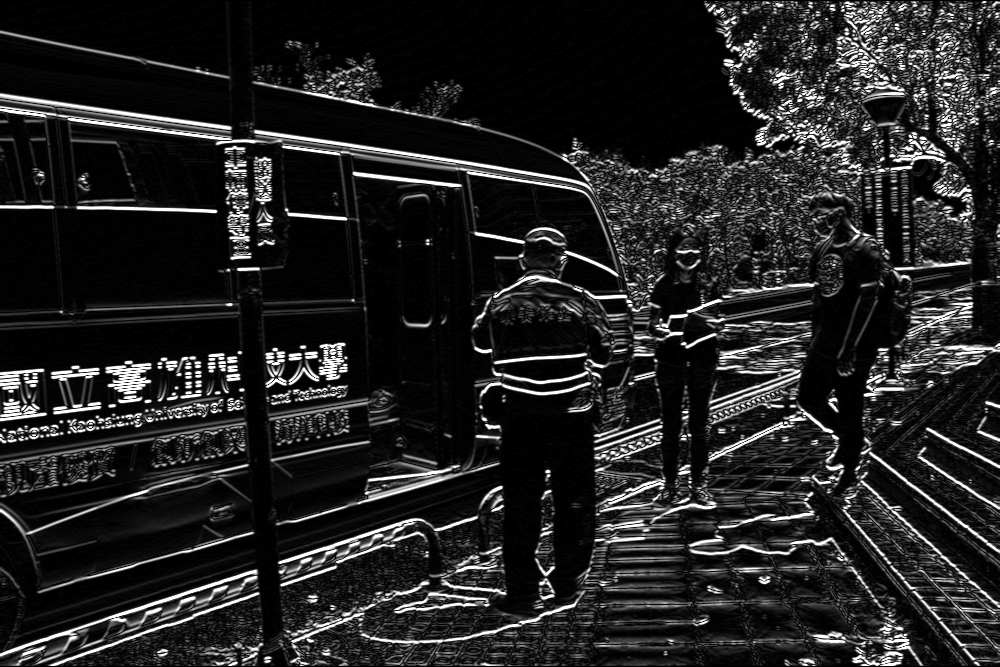

# 作業二 抓取人型

## 需求

從學校首頁另存「等公車的影像」，將影像放到樹莓派裡面，對影像進行sobel或canny，調整參數，將人形的輪廓畫出來。比較哪種方法比較好? 差異在哪?

將結果存成圖片留言在下方，並標註姓名、學號、科系，以及把程式放到git hub 上面，把github的連結也一並附上。

## 原圖

## 灰階

## canny

### 函式：
輸出圖片 = cv2.Canny(輸入圖片(灰階), 最低門檻, 最高門檻)

最低門檻(low_threshold)設定為 100 ，最高門檻(high_threshold)設定為 200 。

## sobel X & sobel Y

### sobel X 

### sobel Y

### 函式：
輸出圖片 = cv2.Sobel(輸入圖片(灰階),輸出圖片的深度, x方向上的差分階數, y方向上的差分階數, kernel大小(必須取1、3、5、7...))

kernel size 皆設定為 3 。

## sobel

### 函式：
輸出圖片 = cv2.addWeighted(輸入圖片1, 圖片1權重, 輸入圖片2, 圖片2權重)

權重皆設定為 0.5 。

以當前參數執行比較後，可以發現Sobel對於人型的邊緣處理比Canny好很多，尤其是後方樹木的干擾影響減少很多。