# 作業三 找一張馬路上的圖片，用紋路(LBP)來區分出馬路與街景的分割。

## 需求

找一張馬路上的圖片，用紋路(LBP)來區分出馬路與街景的分割。

## 原圖

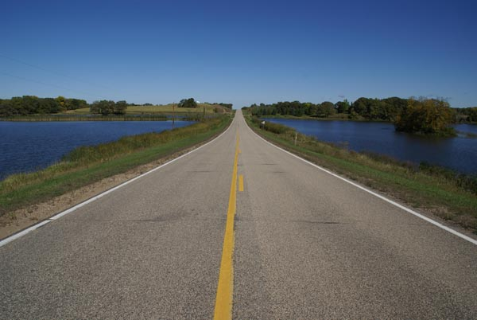

## 灰階

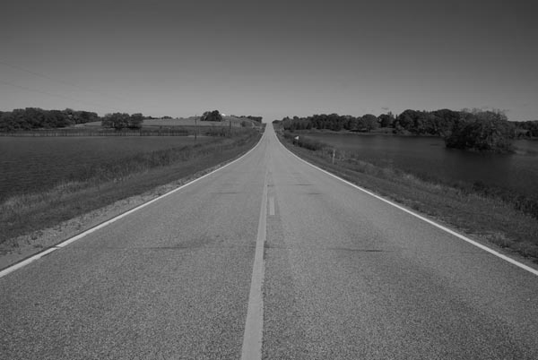

## LBP (Local Binary Patterns)

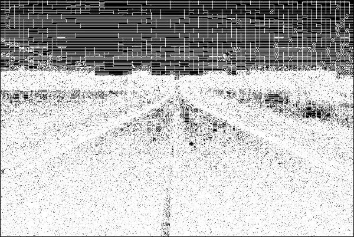

1.取Kernel：假設我們設定每次取3×3共9點像素來計算，以下圖中那紅色區域為例，其九個像素點的強度值從右上順時針開始，周圍的八個點分別為81, 63, 77, 60, 76, 93, 92, 93，中間那點為83。

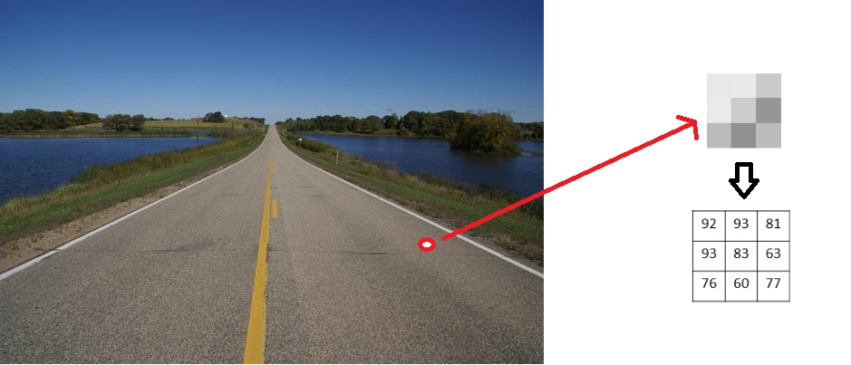

2.比較各點與中間點的強度值，若小於中間點則為0，大於中間點則為1。

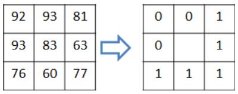

3.將此八個值攤開為二進位後換算為10進制，方向沒有固定，可以順時鐘也可逆時鐘，或從任一像素開始，但若確定此規則，則後續其它的kernels也要依此方式來計算。

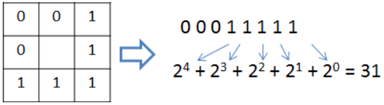

4.將中央的像素值替換為計算出的新值。

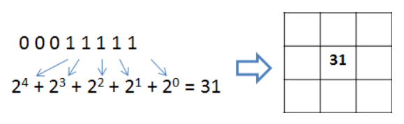

#利用WaterShed進行處理

### 函式：
cv2.watershed(輸入圖像,標記區塊)

##原圖

##找出水點
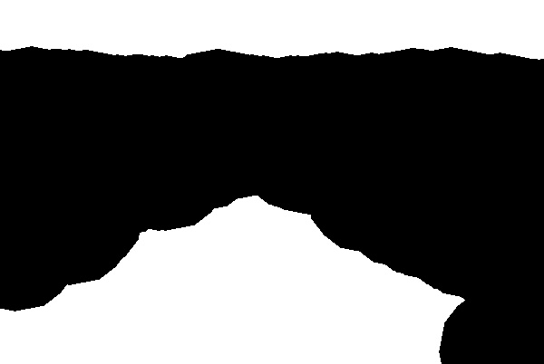

##結果
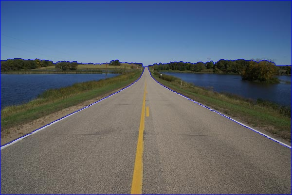

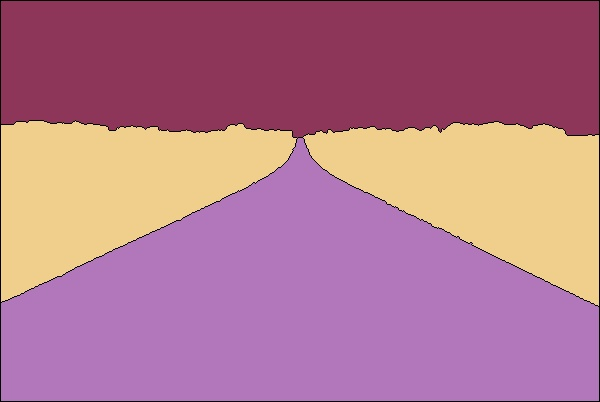

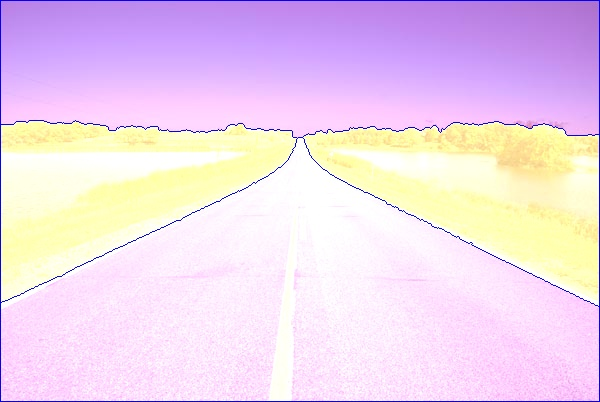

參考：https://chtseng.wordpress.com/2017/04/07/%E9%80%8F%E9%81%8E%E8%91%89%E7%89%87%E7%B4%8B%E7%90%86%E5%88%A4%E6%96%B7%E6%A4%8D%E7%89%A9%E7%A8%AE%E9%A1%9E-%E4%BD%BF%E7%94%A8lbp/